# 🧠 MedIntel AI Healthcare System

An advanced AI-powered healthcare platform designed to assist users with disease prediction, medical insights, and intelligent health monitoring.

---

## 🚀 Features

- ❤️ Heart Disease Prediction  
- 🧠 Alzheimer’s Prediction  
- 📊 User Dashboard  
- 💬 AI Medical Assistant  
- 💊 Medicine Recommendation  
- 👨‍⚕️ Admin Control Panel  
- 📈 Analytics & Reports  
- 🔐 Authentication System  

---

## 🛠️ Tech Stack

Frontend: React.js, HTML, CSS  
Backend: Node.js, Express.js, Python  
Database: MongoDB  
AI/ML: Machine Learning Models  

---

## 📸 Screenshots

### 🏠 Landing Page
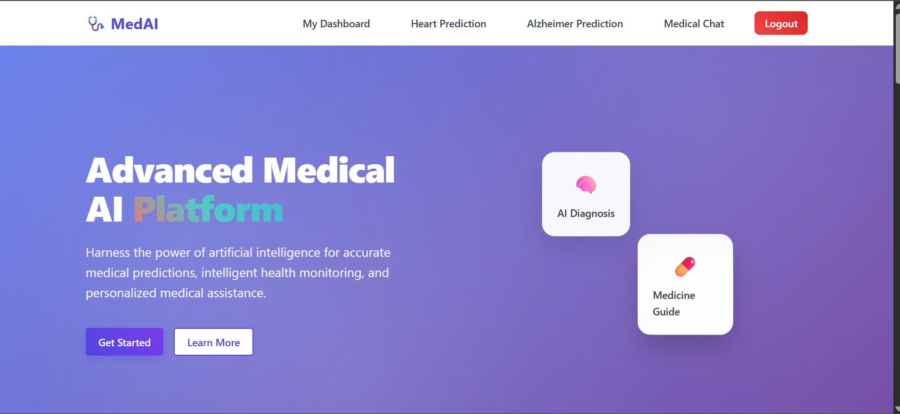

### 📊 User Dashboard
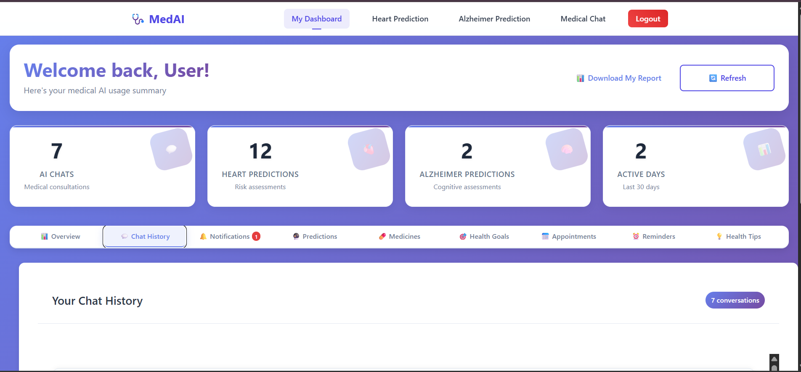

### 📝 Health Data Input Form
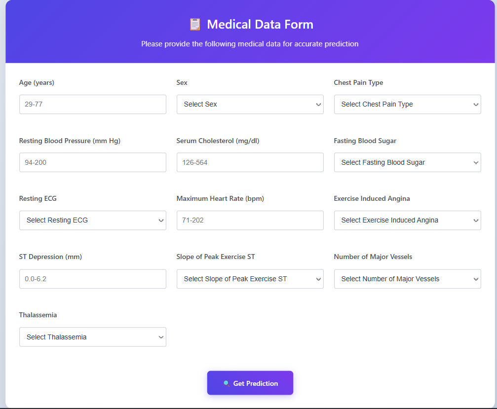

### ❤️ Risk Analysis Result
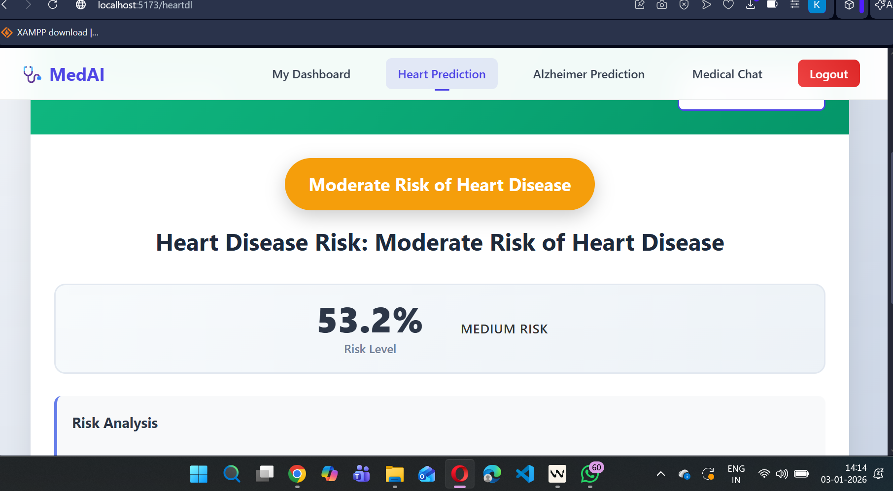

### 📊 Risk Distribution
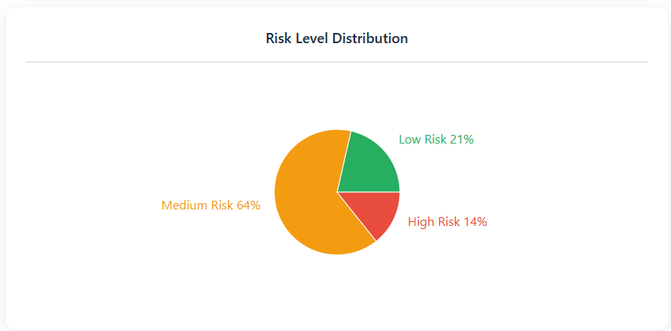

### 📈 Activity Insights
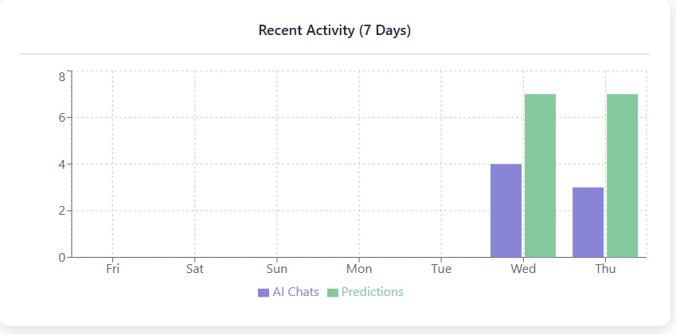

### 💬 AI Medical Assistant
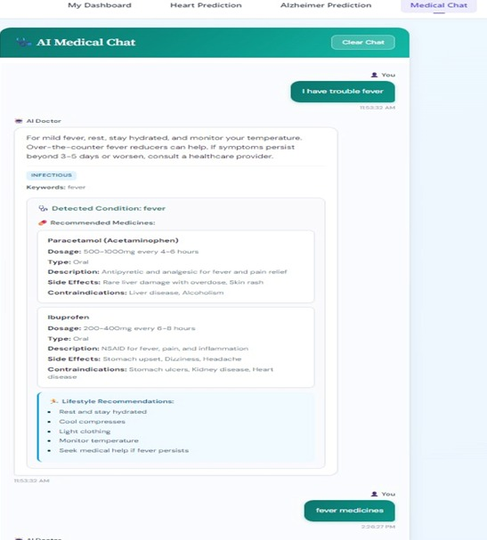

### 💊 Medicine Recommendation
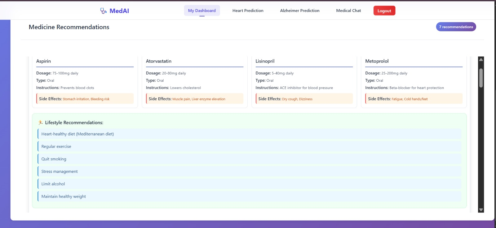

### 👨‍⚕️ Patient Chat
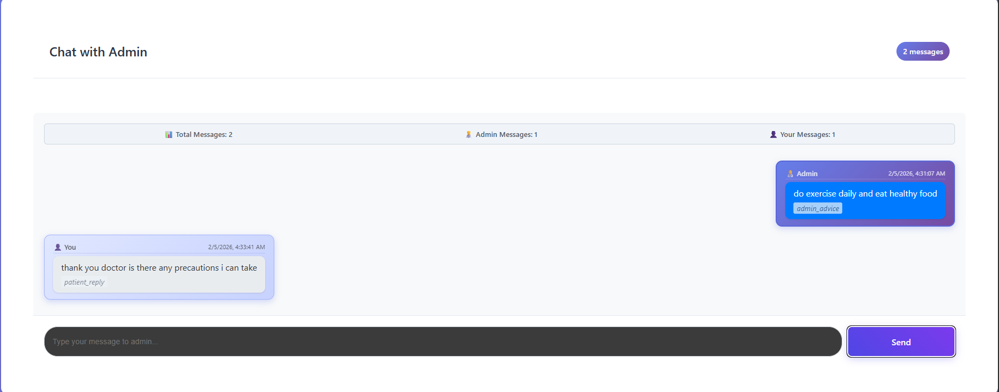

### 💬 Doctor Chat

### 🧠 Admin Panel
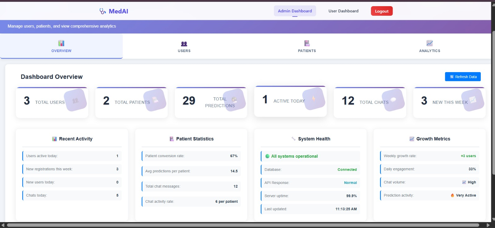

### 🧾 Risk Patients Data
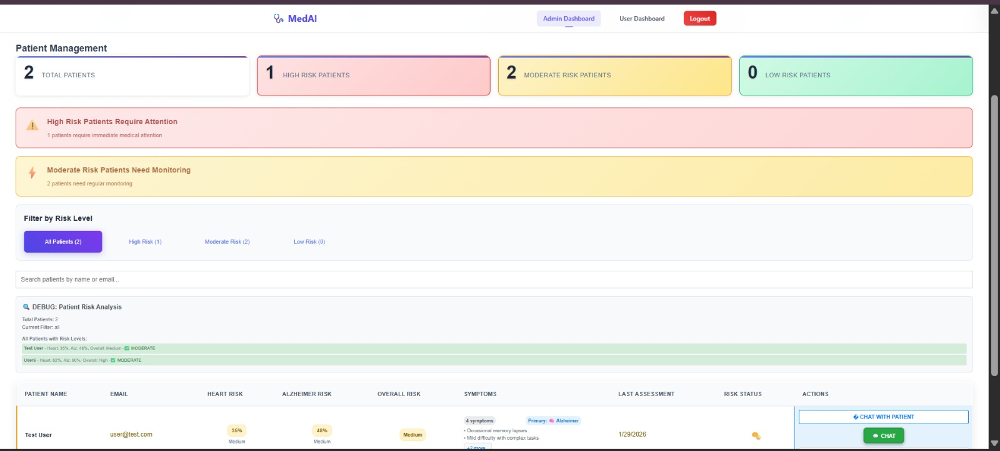

## 👩‍💻 Author

Ojeswari Devi  
GitHub: https://github.com/OjeswariDevi
